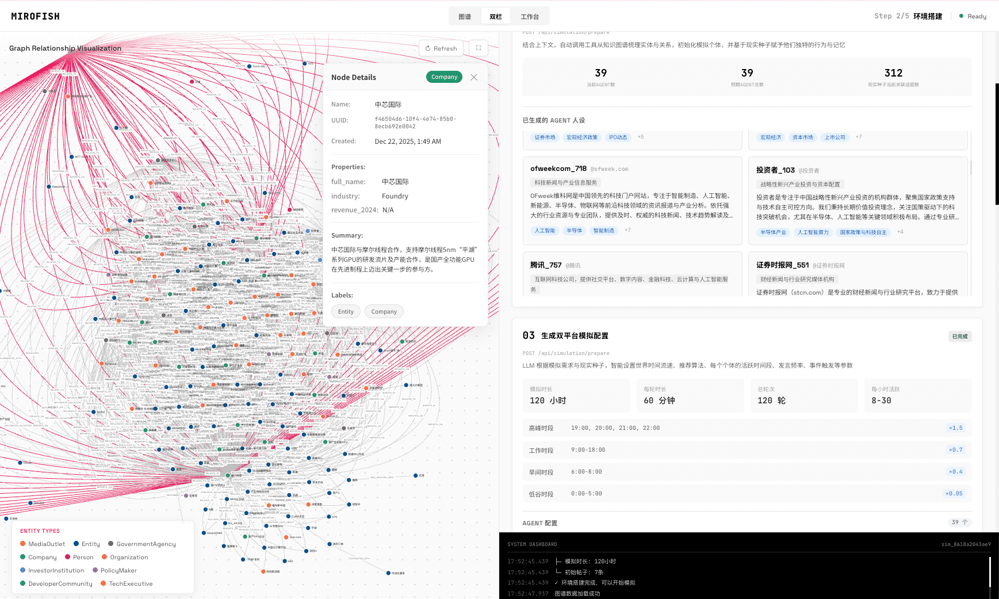
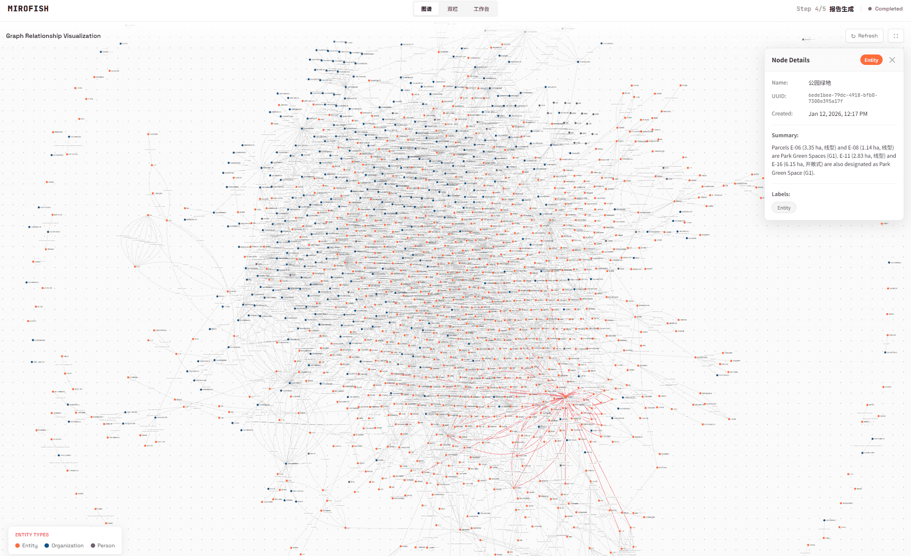

<div align="center">


简洁通用的群体智能引擎，预测万物
</br>
<em>A Simple and Universal Swarm Intelligence Engine, Predicting Anything</em>

<a href="https://www.shanda.com/" target="_blank"></a>

[](https://github.com/666ghj/MiroFish/stargazers)
[](https://github.com/666ghj/MiroFish/watchers)
[](https://github.com/666ghj/MiroFish/network)
[](https://github.com/666ghj/MiroFish/issues)
[](https://github.com/666ghj/MiroFish/pulls)

[](https://github.com/666ghj/MiroFish/blob/main/LICENSE)
[](https://deepwiki.com/666ghj/MiroFish)
[](https://hub.docker.com/)
[](https://github.com/666ghj/MiroFish)

[English](./README-EN.md) | [中文文档](./README.md)

</div>

## ⚡ 项目概述

**MiroFish** 是一款基于多智能体技术的新一代 AI 预测引擎。通过提取现实世界的种子信息（如突发新闻、政策草案、金融信号），自动构建出高保真的平行数字世界。在此空间内，成千上万个具备独立人格、长期记忆与行为逻辑的智能体进行自由交互与社会演化。你可透过「上帝视角」动态注入变量，精准推演未来走向——**让未来在数字沙盘中预演，助决策在百战模拟后胜出**。

> 你只需：上传种子材料（数据分析报告或者有趣的小说故事），并用自然语言描述预测需求</br>
> MiroFish 将返回：一份详尽的预测报告，以及一个可深度交互的高保真数字世界


## 📸 系统截图

<div align="center">
<table>
<tr>
<td></td>
<td></td>
</tr>
<tr>
<td></td>
<td></td>
</tr>
<tr>
<td></td>
<td></td>
</tr>
</table>
</div>

## 🔄 工作流程

1. **图谱构建**：现实种子提取 & 个体与群体记忆注入 & GraphRAG构建
2. **环境搭建**：实体关系抽取 & 人设生成 & 环境配置Agent注入仿真参数
3. **开始模拟**：双平台并行模拟 & 自动解析预测需求 & 动态更新时序记忆
4. **报告生成**：ReportAgent拥有丰富的工具集与模拟后环境进行深度交互
5. **深度互动**：与模拟世界中的任意一位进行对话 & 与ReportAgent进行对话

## 🚀 快速开始

### 一、源码部署（推荐）

#### 前置要求

| 工具 | 版本要求 | 说明 | 安装检查 |
|------|---------|------|---------|
| **Node.js** | 18+ | 前端运行环境，包含 npm | `node -v` |
| **Python** | ≥3.11, ≤3.12 | 后端运行环境 | `python --version` |
| **uv** | 最新版 | Python 包管理器 | `uv --version` |

#### 1. 配置环境变量

```bash
# 复制示例配置文件
cp .env.example .env

# 编辑 .env 文件，填入必要的 API 密钥
```

**必需的环境变量：**

```env
# LLM API配置（支持 OpenAI SDK 格式的任意 LLM API）
# 推荐使用阿里百炼平台qwen-plus模型：https://bailian.console.aliyun.com/
# 注意消耗较大，可先进行小于40轮的模拟尝试
LLM_API_KEY=your_api_key
LLM_BASE_URL=https://dashscope.aliyuncs.com/compatible-mode/v1
LLM_MODEL_NAME=qwen-plus

#重构成使用MEMO_API_KEY
MEM0_API_KEY
```

#### 2. 安装依赖

```bash
# 一键安装所有依赖（根目录 + 前端 + 后端）
npm run setup:all
```

或者分步安装：

```bash
# 安装 Node 依赖（根目录 + 前端）
npm run setup

# 安装 Python 依赖（后端，自动创建虚拟环境）
npm run setup:backend
```

#### 3. 启动服务

```bash
# 同时启动前后端（在项目根目录执行）
npm run dev
```

**服务地址：**
- 前端：`http://localhost:3000`
- 后端 API：`http://localhost:5001`

**单独启动：**

```bash
npm run backend   # 仅启动后端
npm run frontend  # 仅启动前端
```

## 1. 项目概览 (Project Overview)

**MiroFish** 是一个基于 AI 的个人知识库与图谱构建系统。它能够读取用户上传的非结构化文本（如 PDF、TXT），通过大模型（LLM）提取实体与关系，构建可视化的知识图谱，并提供基于语义的智能问答功能。

本项目旨在为个人开发者提供一个**低成本、零运维负担**的解决方案。

---

## 2. 本次重构目标与边界 (Refactoring Goals)

为了降低部署难度并移除对重型云服务（Zep Cloud）的依赖，我们对后端架构进行了深度重构，实现了 **"Free Plan"** 架构。

### 核心变更
1.  **移除 Zep Cloud**: 不再依赖 Zep 进行图谱存储和检索。
2.  **双管道架构 (Dual Pipeline)**:
    *   **Pipeline A (Semantic Memory)**: 使用 **Mem0 Cloud** (通过 REST API) 存储文本块的向量索引，用于语义搜索。
    *   **Pipeline B (Knowledge Graph)**: 使用 **Local JSON** 文件存储图谱的节点（Node）和边（Edge）结构，用于前端 D3.js 可视化。
3.  **移除 Mem0 SDK**: 为了避免 `mem0` Python SDK 强制依赖 OpenAI SDK 导致的 `LLM_API_KEY` (DashScope/Qwen) 冲突问题，我们移除了 `mem0` SDK，转而实现了轻量级的 `Mem0Client` (REST based)。

---

## 3. 端到端业务流程 (End-to-End Flow)

### 3.1 图谱构建流程 (`/api/graph/build`)

当用户上传文件并点击“生成图谱”时，后端 `GraphBuilderService` 会并行触发两条流水线：

```mermaid
graph TD
    User[用户请求 /api/graph/build] --> API[Graph API]
    API --> Builder[GraphBuilderService]
    
    subgraph "Pipeline A: 语义记忆 (Mem0 Cloud)"
    Builder -- 1. 文本分块 --> Chunk[Text Chunks]
    Chunk -- 2. REST API (Add) --> Mem0[Mem0 Cloud]
    Mem0 -- 3. 存储向量 --> VectorDB[(Vector Store)]
    end
    
    subgraph "Pipeline B: 知识图谱 (Local JSON)"
    Builder -- 1. LLM 提取实体/关系 --> Extraction[Entity Extraction (Qwen-Plus)]
    Extraction -- 2. 构建图结构 --> LocalStore[LocalGraphStore]
    LocalStore -- 3. 写入文件 --> JSON[(backend/data/graphs/{id}.json)]
    end
    
    JSON --> D3[前端 D3.js 渲染]
```

### 3.2 搜索与问答流程 (`/api/chat` 或工具调用)

1.  **语义检索**: 调用 `Mem0Client.search(query)` 从 Mem0 Cloud 获取相关的文本片段。
2.  **图谱检索**: (可选) 读取本地 JSON 加载图结构。
3.  **生成回答**: LLM 结合检索到的上下文生成最终回复。

---

## 4. 目录结构总览 (Directory Structure)

仅列出核心后端文件：

```text
backend/
├── app/
│   ├── api/
│   │   ├── graph.py            # [API] 图谱构建入口，包含详细的错误堆栈日志
│   │   └── ...
│   ├── core/
│   │   └── config.py           # [Config] 环境变量加载
│   ├── services/
│   │   ├── graph_builder.py    # [Core] 图谱构建核心编排 (Pipeline A & B)
│   │   ├── graph_tools.py      # [Tool] 搜索与报表工具，调用 Mem0Client
│   │   ├── local_graph_store.py# [Store] 本地 JSON 图谱存取逻辑
│   │   ├── mem0_client.py      # [Client] 自研 Mem0 REST 客户端 (替代 SDK)
│   │   ├── entity_reader.py    # [Helper] 简单的实体读取适配器
│   │   └── ...
│   └── ...
├── data/
│   └── graphs/                 # [Data] 存放生成的图谱 JSON 文件
│       └── {graph_id}.json
├── requirements.txt            # 依赖列表 (新增 requests, 移除 zep-cloud)
└── ...
```

---

## 5. 【重构重点】模块详解 (Key Modules)

### 5.1 `Mem0Client` (`backend/app/services/mem0_client.py`)
这是本次重构的核心组件。它是一个纯 Python `requests` 实现的客户端，用于与 `api.mem0.ai` 通信。

*   **设计初衷**: 解决 `mem0` SDK 强制检查 `OPENAI_API_KEY` 的问题，兼容 DashScope (`qwen-plus`)。
*   **主要方法**:
    *   `add(messages, user_id)`: 上传文本块到 Mem0。
    *   `search(query, user_id)`: 执行语义搜索。
    *   `delete_all(user_id)`: 清空用户记忆。
*   **容错性**: 如果 Mem0 API 调用失败（如网络超时），它会记录 Error 日志但**不会抛出异常**，确保 Pipeline B（本地图谱构建）能继续完成。

### 5.2 `GraphBuilderService` (`backend/app/services/graph_builder.py`)
协调者服务。

*   **`build_graph`**: 入口方法，负责读取文件内容。
*   **`_build_graph_worker`**: 异步工作线程。
    *   **步骤 1**: 初始化 `LocalGraphStore`。
    *   **步骤 2 (Pipeline A)**: 调用 `Mem0Client` 将文本存入云端。此步骤包含 `try-except` 保护，失败仅打印警告。
    *   **步骤 3 (Pipeline B)**: 调用 LLM 提取实体，构建 `nx.Graph`，并通过 `LocalGraphStore` 保存为 JSON。

### 5.3 `LocalGraphStore` (`backend/app/services/local_graph_store.py`)
负责图谱数据的持久化。

*   **存储路径**: `backend/data/graphs/{graph_id}.json`。
*   **数据格式**: 标准的 NetworkX node-link data 格式。
    ```json
    {
      "nodes": [{"id": "Entity1", "type": "Person", ...}],
      "links": [{"source": "Entity1", "target": "Entity2", "relation": "Knows", ...}]
    }
    ```

---

## 6. 环境变量与配置 (Configuration)

在 `.env` 文件中必须配置以下关键变量：

| 变量名 | 说明 | 示例值 |
| :--- | :--- | :--- |
| `LLM_API_KEY` | **DashScope (阿里云)** API Key，用于图谱提取 | `sk-xxx` |
| `LLM_MODEL` | 使用的模型名称 | `qwen-plus` |
| `MEM0_API_KEY` | **Mem0 Cloud** API Key，用于语义记忆 | `m0-xxx` |

> **注意**: 严禁设置 `OPENAI_API_KEY`，除非你确实在使用 OpenAI 的服务。本项目默认使用 DashScope。


